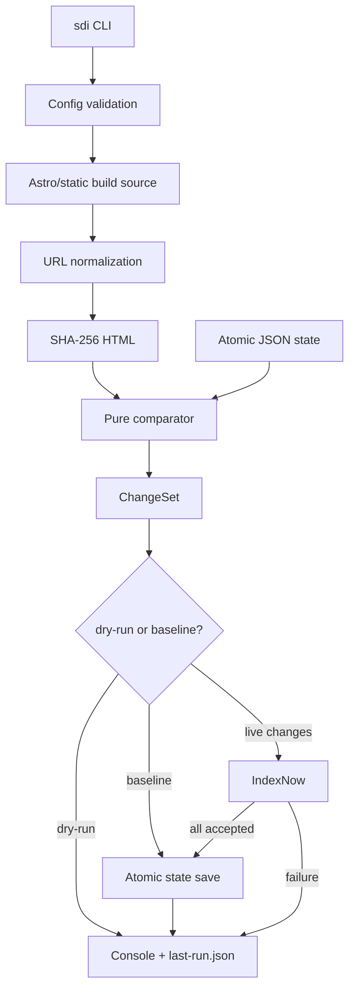

# SDI Product Architecture

## Estado del documento

- **Versión:** 0.1
- **Estado:** Congelado para implementación.
- La arquitectura descrita en este documento constituye la fuente de verdad para SDI 0.1.
- Toda modificación arquitectónica posterior deberá realizarse mediante un ADR.
- La implementación no debe modificar silenciosamente este documento.

**Fecha de corte:** 2026-07-10  
**Producto:** **SDI — Search Discovery Infrastructure**

> Esta es la fuente de verdad para Terra y los siguientes chats de implementación. Los hechos observados se distinguen de las decisiones. Ninguna implementación actual se considera canónica.

## 1. Resumen ejecutivo

SDI resuelve hoy un problema concreto: la misma lógica de descubrimiento y envío de URLs fue copiada y modificada en varios proyectos. Las copias ya divergen: unas reenvían todo el sitemap, otras guardan estado aunque falle el destino, otras reintentan implícitamente y ninguna maneja bien eliminaciones, persistencia o reportes.

**SDI 0.1 será una sola herramienta npm, pequeña y reutilizable, para sitios Astro estáticos.** Después del deploy, leerá el sitemap/build, normalizará las URLs, calculará SHA-256 del HTML, detectará URLs creadas, modificadas y eliminadas, notificará únicamente esos cambios a IndexNow, guardará el estado de forma atómica y escribirá un reporte del run.

La arquitectura sigue siendo:

```text
Source → Normalize → Fingerprint → Compare → Destination → Report
```

El recorte de alcance es deliberado:

- un repositorio y un paquete, no un monorepo de paquetes;
- un source de build Astro/estático, no crawling ni sitemap remoto;
- un state store JSON, no outbox, CAS, KV o D1;
- un destino live, IndexNow;
- sin sistema de plugins;
- sin Google Indexing API;
- sin Worker, SaaS, scheduler ni GitHub Action publicada.

Google queda fuera porque su documentación oficial limita la Indexing API a páginas con `JobPosting` o `BroadcastEvent` dentro de `VideoObject`. Los proyectos inspeccionados son blogs, herramientas y un directorio veterinario; no se encontró evidencia de URLs elegibles. Mantener el adapter en 0.1 sería construir código sin un usuario válido actual.

El piloto sigue siendo **HouseGatitos**, porque contiene la variante incremental más madura, ejecuta discovery después del deploy, conserva 84 URLs y expone los fallos reales que SDI debe solucionar.

## 2. Definición de SDI

SDI detecta cambios relevantes en las URLs publicadas por un sitio y comunica esos cambios a destinos de descubrimiento.

No promete indexación, ranking ni tiempo de aparición. Una respuesta aceptada de IndexNow significa que el endpoint recibió la notificación, no que un buscador vaya a indexar la URL.

Para 0.1, “cambio relevante” significa:

- URL nueva en el inventario;
- misma URL con SHA-256 diferente en su HTML compilado;
- URL presente en el estado anterior y ausente del build actual.

El HTML completo es un criterio imperfecto, pero reproduce el comportamiento real existente. Un fingerprint semántico solo se diseñará después de medir falsos positivos del producto unificado.

## 3. Alcance y no alcance

### Incluido en 0.1

- Un paquete npm ESM con binario `sdi`.
- Node 22.12 o superior; Node 24 LTS recomendado.
- Comandos `sdi run` y `sdi baseline`.
- Configuración mediante `sdi.config.mjs`.
- Source para output Astro/HTML estático, usando sitemap local y fallback por directorio.
- Normalización con política explícita de slash final.
- SHA-256 de los bytes del HTML compilado.
- `ChangeSet` con `created`, `updated`, `unchanged` y `deleted`.
- Estado JSON único, versionado, validado y escrito atómicamente.
- Lectura automática del formato legacy `sdi-state.json` para migrar sin reenvío total.
- IndexNow para altas, cambios y eliminaciones.
- Timeout y retries acotados para errores transitorios observados.
- Consola y `.sdi/last-run.json` como reporte.
- Dry-run, force y baseline.
- Ejecución local o como paso Node de CI después del deploy.
- Migración progresiva de House, Cuida, RuletaWeb y Vet24.

### Fuera de 0.1

- Google Indexing API.
- Paquetes separados, API pública de plugins o adapters de terceros.
- Sitemap remoto, crawling, webhooks o listado explícito como source de producto.
- State stores en memoria salvo fake de tests; KV, D1, Durable Objects o base de datos.
- Outbox persistente, resultados por destino, destinos required/best-effort o reintentos entre runs.
- SaaS, UI web, usuarios, auth, scheduler o colas.
- Worker/Pages Function como runtime de SDI.
- GitHub Action publicada.
- CJS, Node 20 o runtimes no Node.
- Fingerprint semántico/configurable.
- Exactly-once hacia APIs externas.

Estos elementos no se eliminan de la visión del producto. Solo se implementarán cuando exista un caso real que los requiera.

## 4. Inventario de implementaciones encontradas

### 4.1 Prototipo separado `SDI/` (“SBI Canonical”)

| Campo | Evidencia |
|---|---|
| Ubicación | `C:\Users\grcx1\OneDrive\Documentos\SDI` |
| Estado Git | Todo el contenido está sin seguimiento. No tiene historial que lo convierta en release canónica. |
| Comandos | `npm run dev`, `npm run start`; bin actual `sbi`. |
| Source | Sitemap local por regex y fallback de HTML. |
| Fingerprint | SHA-256 del HTML; hash de la URL si no encuentra archivo. |
| Estado | `.sbi/state.json` y manifiesto separado. |
| Destinos | IndexNow y Google. |
| Aportes | CLI, dry-run, force, modos de destino y compatibilidad de credenciales. |
| Defectos | Escritura no atómica, sin retry/timeout/lock, eliminaciones no publicadas, resultado parcial incorrecto y exit code no fiable. |

El prototipo compila (`npm run check` pasa), pero es material de referencia. Terra no debe refactorizarlo como si sus contratos ya estuvieran aprobados.

### 4.2 CuidaTuPerroViejo

| Campo | Evidencia |
|---|---|
| Ubicación | `C:\Users\grcx1\OneDrive\Documentos\Proyectos\CuidaTuPerroViejo\lib\discovery` |
| Historia | SDI V0 en commit `9b857f5` (2026-06-06); postbuild en `84d5d4e`. |
| Ejecución | `postbuild: npx tsx lib/discovery/run.ts`; `npm run sdi:run`. |
| Entradas | `dist/sitemap-0.xml`, HTML, `.env` y variables `SDI_*`. |
| Salidas | `sdi-state.json`, `sdi-manifest.json`, `sdi-submissions.json`. |
| Estado real | 26 URLs; 1.595 entradas de log, 633 KB. |
| Destinos | IndexNow y Google. |
| Fallos | Guarda estado incluso cuando fallan destinos; atrapa errores y termina con exit 0. |

El postbuild puede anunciar cambios antes de que `wrangler deploy` publique el nuevo sitio. Se observaron 1.370 errores `fetch failed` por destino, además de propiedad Google 403 y clave IndexNow inválida.

### 4.3 HouseGatitos

| Campo | Evidencia |
|---|---|
| Ubicación | `C:\Users\grcx1\OneDrive\Documentos\Proyectos\HouseGatitos\lib\discovery` |
| Historia | Commit `379f72e` (2026-06-19). Cinco de siete archivos son idénticos a Cuida. |
| Ejecución | `npm run discovery`; deploy: build → deploy → discovery. |
| Estado real | 84 URLs con slash final; 555 entradas de log, 219 KB. |
| Diferencias | `forceSubmit`, Google opcional y avance condicionado por IndexNow. |
| Certificados | Runner con `--use-system-ca`. |
| Fallos | 244 `fetch failed` por destino y 20 errores de cuota Google. |

Es la mejor base conductual, pero no se copiará literalmente: todavía tiene estado/manifiesto/log separados, no publica eliminaciones y clasifica mal éxitos parciales de Google.

### 4.4 Vet24 (`vete/veterinarias-cr`)

| Campo | Evidencia |
|---|---|
| Ubicación | `scripts/google-indexing.js` |
| Ejecución | `npm run indexing`; `npm run indexing:dry`. |
| Descubrimiento | Todas las URLs de `dist/sitemap-0.xml`. |
| Estado/hash | Ninguno. Reenvía todo en cada run. |
| Destino | Solo Google, una URL por request, pausa fija de 300 ms. |
| Seguridad | Define `NODE_TLS_REJECT_UNAUTHORIZED=0`. |
| Errores | Continúa, imprime conteos y normalmente termina con exit 0 aunque haya fallos. |

`clinics-links-manifest.json.js` pertenece a otra función y no es parte de SDI.

### 4.5 RuletaWeb / Decídelo

`scripts/google-indexing.js` es casi idéntico al de Vet24: cambia branding y comentarios. Tiene `npm run index`/`index:dry`, reenvía el sitemap completo, no guarda estado y deshabilita TLS. El commit de incorporación es `af16f4c` del 2026-06-21.

### 4.6 `ruleta-app`

No contiene integración SDI. No forma parte de la migración.

## 5. Comparación entre implementaciones

| Capacidad | Cuida | House | Vet24 | RuletaWeb | Prototipo |
|---|---:|---:|---:|---:|---:|
| Sitemap local | Sí | Sí | Sí | Sí | Sí |
| Escaneo HTML fallback | Sí | Sí | No | No | Sí |
| Hash HTML | Sí | Sí | No | No | Sí |
| Cambios incrementales | Sí | Sí | No | No | Sí |
| Eliminadas detectadas | Sí | Sí | No | No | Sí |
| Eliminadas publicadas | No | No | No | No | No |
| Estado persistido | JSON | JSON | No | No | JSON |
| Escritura atómica | No | No | N/A | N/A | No |
| Retry/timeout | No | No | No | No | No |
| Dry-run real | No | No | Sí | Sí | Sí |
| Force | No | Sí | Siempre | Siempre | Sí |
| Exit code fiable | No | No | No | No | No |

### Decisiones derivadas

1. House aporta la semántica incremental más correcta.
2. El estado no debe avanzar si IndexNow no acepta todos los batches.
3. No se necesita outbox con un solo destino: ante fallo se conserva el snapshot anterior y el siguiente run reintenta el conjunto.
4. Si algunos batches ya fueron aceptados antes del fallo, se repetirán. IndexNow tolera reenvíos; SDI 0.1 ofrece at-least-once, no exactly-once.
5. Eliminaciones se envían a IndexNow antes de retirarlas del estado.
6. La política de slash es por sitio: `never` para Cuida/Ruleta, `always` para House/Vet24.
7. Nunca se deshabilita TLS. Certificados corporativos usan el trust store del sistema o `NODE_EXTRA_CA_CERTS`.
8. “SBI” no tiene una decisión de marca. Producto y bin se llaman SDI/`sdi`.

## 6. Flujo actual reconstruido

### Familia incremental

1. Astro genera sitemap y HTML.
2. El runner carga `.env` con parser propio.
3. Lee `<loc>` por regex o escanea `.html`.
4. Mapea cada URL a `index.html` o `<ruta>.html`.
5. Calcula SHA-256 de bytes; si no encuentra archivo, usa hash de la URL.
6. Compara con `sdi-state.json`; el manifiesto separado detecta eliminaciones.
7. Publica nuevas/modificadas, pero nunca eliminadas.
8. Reescribe el state completo una vez por URL y luego reescribe un log histórico completo.
9. Guarda manifiesto aunque haya errores. Estado, manifiesto y log pueden divergir.

### Familia de envío total

1. Lee todas las URLs del sitemap.
2. Carga credenciales Google y genera JWT.
3. Envía todas las URLs como `URL_UPDATED`.
4. No distingue cambios ni conserva resultados.
5. Deshabilita TLS y no falla el proceso por errores parciales.

## 7. Problemas y deuda técnica

### Problemas que SDI 0.1 sí resuelve

- Código duplicado y divergente.
- Reenvío de URLs sin cambios.
- Estado guardado tras fallo y pérdida de reintentos.
- Tres archivos de persistencia que pueden quedar inconsistentes.
- Escritura JSON no atómica/corruptible.
- Eliminaciones detectadas pero no notificadas.
- Falta de timeout/retry ante fallos de red y 429 observados.
- TLS deshabilitado en dos proyectos.
- Logs crecientes sin run ID ni duración.
- Exit codes que ocultan fallos.
- Orden de ejecución anterior al deploy.

### Problemas reales que se documentan, pero no se resuelven en 0.1

- HTML compilado puede producir falsos positivos.
- Un estado local puede perderse en un runner CI efímero.
- Una caída después de aceptación externa y antes del save produce duplicado.
- Dos procesos simultáneos requieren exclusión.

Para el último punto, 0.1 usa un lock file exclusivo y falla rápido; no implementa coordinación distribuida.

### Problemas futuros que no justifican infraestructura hoy

- Múltiples destinos con confirmaciones independientes.
- Plugins de terceros.
- Multiusuario/multisitio hospedado.
- Crawling remoto.
- State stores distribuidos.
- Schedulers, colas y dashboard.

## 8. Alternativas de producto consideradas

| Alternativa | Valor actual | Coste | Decisión 0.1 |
|---|---|---|---|
| Scripts copiados | Ninguno adicional | Divergencia continua | Rechazar. |
| Solo librería | Reutiliza core | Cada sitio debe crear runner | No como interfaz principal. |
| Un paquete CLI | Resuelve instalación y ejecución | Bajo | **Elegido.** |
| Monorepo multipaquete | Aislamiento futuro | Versionado/tooling prematuro | Postergar. |
| Plugin system | Destinos externos futuros | API pública y compatibilidad | Postergar. |
| Integración Astro separada | Mejor nombre/DX | Otro paquete sin necesidad | Mantener como módulo interno. |
| GitHub Action | Conveniencia en un proveedor | Persistencia y mantenimiento extra | Receta CI solamente. |
| Worker/SaaS | Scheduling y gestión central | Producto operativo distinto | Postergar. |

### Regla para agregar infraestructura

Un componente futuro entra cuando aparece su trigger:

- segundo destino live → evaluar checkpoints/outbox;
- primer source no basado en build local → extraer adapters públicos;
- primer consumidor externo de la API → estabilizar paquetes públicos;
- ejecución repetida en runners efímeros → diseñar state remoto;
- necesidad real de scheduling/usuarios → evaluar servicio hospedado;
- sitio elegible para Google → diseñar adapter Google como iniciativa separada.

## 9. Arquitectura recomendada para 0.1

SDI será un solo paquete con módulos internos y límites claros:

1. **Config:** carga `sdi.config.mjs`, `.env` y flags; valida valores.
2. **Astro build source:** obtiene inventario desde sitemap local o directorio HTML.
3. **Normalize:** valida origen, elimina fragmento y aplica slash.
4. **Fingerprint:** SHA-256 de bytes HTML.
5. **Compare:** función pura que produce `ChangeSet`.
6. **File state:** carga/valida snapshot, importa legacy y guarda atómicamente.
7. **IndexNow:** publica created/updated/deleted con timeout/retry.
8. **Run/report:** orquesta, decide exit code y escribe consola/JSON.

Los módulos respetan `Source → Normalize → Fingerprint → Compare → Destination → Report`, pero no son paquetes ni plugins. Solo se exporta lo que necesita el CLI y las pruebas. La API pública queda mínima hasta que exista un consumidor real distinto del propio CLI.

### Decisiones de consistencia

- Un run adquiere `.sdi/run.lock` con creación exclusiva. Si ya existe y no es stale, falla.
- El estado anterior se mantiene intacto durante discovery y publicación.
- Solo después de que IndexNow acepte todos los batches se escribe el nuevo estado.
- El save usa archivo temporal en el mismo directorio, validación, rename y backup `.bak`.
- JSON inválido aborta; nunca se interpreta como primer run.
- Si IndexNow falla, el siguiente run recalcula y reintenta.
- Si se aceptó un batch y falla otro, el siguiente run puede repetir el primero. Es comportamiento at-least-once explícito.

## 10. Diagrama de componentes



## 11. Contratos principales en TypeScript

Los contratos son pequeños y responden al único flujo real de 0.1:

```ts
export interface UrlRecord {
  url: string;
  hash: string;
  lastmod?: string;
}

export interface DiscoveredResource {
  url: string;
  filePath: string;
  lastmod?: string;
}

export interface DiscoveryState {
  schemaVersion: 1;
  siteId: string;
  siteUrl: string;
  trailingSlash: "preserve" | "always" | "never";
  fingerprintProfile: "sha256-raw-html-v1";
  updatedAt: string;
  resources: Record<string, UrlRecord>;
}

export interface ChangeSet {
  created: UrlRecord[];
  updated: Array<{ before: UrlRecord; after: UrlRecord }>;
  unchanged: UrlRecord[];
  deleted: UrlRecord[];
}

export interface Source {
  discover(): Promise<DiscoveredResource[]>;
}

export interface StateStore {
  load(): Promise<DiscoveryState | null>;
  save(next: DiscoveryState): Promise<void>;
}

export interface Destination {
  publish(changes: ChangeSet): Promise<PublishResult>;
}

export type TransportFailureKind =
  | "timeout"
  | "network"
  | "aborted";

export type BatchPublishResult =
  | {
      size: number;
      attempts: number;
      status: number;
      failure?: never;
    }
  | {
      size: number;
      attempts: number;
      status: null;
      failure: TransportFailureKind;
    };

export interface PublishResult {
  accepted: boolean;
  submittedUrls: number;
  batches: BatchPublishResult[];
}
```

`Source` solo descubre URL + archivo; normalize/fingerprint convierten ese resultado en `UrlRecord`. `Source`, `StateStore` y `Destination` son seams internos para pruebas. No constituyen una API de plugins. No se crean `ExecutionContext`, `SecretProvider`, `RetryPolicy`, `Reporter`, capabilities ni resultados por destino: en 0.1 solo existe un destino y las opciones se pasan como objetos simples.

La normalización, fingerprint y comparación son funciones puras, no interfaces. Se extraerán como estrategias únicamente cuando exista una segunda implementación real.

## 12. Modelo de configuración

Archivo soportado en 0.1: `sdi.config.mjs`.

```js
export default {
  siteId: "housegatitos",
  siteUrl: "https://housegatitos.com",
  source: {
    distDir: "./dist",
    sitemapPath: "./dist/sitemap-0.xml",
    fallbackToHtmlScan: true,
  },
  normalization: {
    trailingSlash: "always",
  },
  statePath: "./.sdi/state.json",
  legacyStatePath: "./lib/discovery/state/sdi-state.json",
  reportPath: "./.sdi/last-run.json",
  indexNow: {
    keyEnv: "INDEXNOW_KEY",
    keyLocation: "https://housegatitos.com/<indexnow-key>.txt",
  },
};
```

### Validación

- `siteId`, `siteUrl`, `source.distDir`, `statePath` e `indexNow` son obligatorios para live.
- `siteUrl` debe ser HTTP(S) y todas las URLs descubiertas deben tener el mismo origin.
- `trailingSlash` solo acepta `preserve|always|never`.
- Rutas se resuelven contra el directorio del config.
- `legacyStatePath` es opcional y solo se consulta cuando `statePath` todavía no existe.
- Unknown keys son error para evitar typos silenciosos.
- `INDEXNOW_KEY` se resuelve desde environment y nunca se escribe en estado/reporte.
- En `dry-run`/`baseline`, la clave no es obligatoria.

### Precedencia

1. Defaults del producto.
2. `sdi.config.mjs`.
3. Variables heredadas permitidas durante migración: `SDI_SITE_URL`, `SDI_DIST_DIR`, `SDI_STATE_PATH` e `INDEXNOW_KEY`.
4. Flags CLI no sensibles.

No hay environments overlays, providers de secretos ni config TypeScript en 0.1. El CLI puede cargar `.env` local sin sobrescribir variables ya definidas.

### CLI

```text
sdi run [--dry-run] [--force] [--config=path]
sdi baseline [--config=path]
```

- `run`: detecta y, salvo dry-run, publica cambios.
- `--dry-run`: no llama red ni modifica estado.
- `--force`: trata todas las URLs actuales como updated; la clasificación normal de eliminadas no cambia.
- `baseline`: guarda el inventario actual sin publicar; requiere confirmación explícita y se usa en nuevas adopciones sin state legacy.

## 13. Modelo de estado

Un solo archivo sustituye state + manifest. Ejemplo:

```json
{
  "schemaVersion": 1,
  "siteId": "housegatitos",
  "siteUrl": "https://housegatitos.com",
  "trailingSlash": "always",
  "fingerprintProfile": "sha256-raw-html-v1",
  "updatedAt": "2026-07-10T18:00:00.000Z",
  "resources": {
    "https://housegatitos.com/": {
      "url": "https://housegatitos.com/",
      "hash": "<sha256>",
      "lastmod": "2026-07-10T17:55:00.000Z"
    }
  }
}
```

### Compatibilidad legacy

Los estados actuales son mapas URL → `{url, hash, lastmod}` sin wrapper. Al cargarlos:

1. si `statePath` no existe y se configuró `legacyStatePath`, leer esa ruta sin modificarla;
2. reconocer formato exacto;
3. validar cada URL/hash;
4. aplicar normalización configurada y detectar colisiones;
5. crear backup sin modificar el original;
6. usarlo como snapshot anterior;
7. escribir schema v1 solo después de un `baseline` confirmado o un run live exitoso.

El manifiesto legacy no es necesario porque las claves del state ya forman el inventario anterior. Si state y manifiesto difieren, state prevalece y el reporte emite warning.

### Escritura segura

- Crear directorio.
- Serializar/validar el documento completo una vez.
- Escribir `<state>.tmp` en el mismo filesystem.
- Flush cuando Node/OS lo permita.
- Mover el state previo a `.bak` y renombrar temp.
- Si state es inválido, intentar `.bak`; si ambos fallan, abortar.

No hay revision, outbox, tombstones ni historial dentro del state.

## 14. Modelo de `ChangeSet`

La comparación usa URL normalizada como identidad y hash como versión:

- no estaba antes, está ahora → `created`;
- estaba antes y hash cambió → `updated`;
- estaba antes y hash coincide → `unchanged`;
- estaba antes y no está ahora → `deleted`.

`lastmod` es metadata para reporte; no dispara cambios. El output se ordena por URL para que reportes/tests sean deterministas.

Guardas de seguridad:

- inventario vacío aborta por defecto;
- URLs fuera del origin abortan;
- una URL incluida en sitemap sin HTML local correspondiente aborta; 0.1 no finge estabilidad usando hash de la URL;
- dos entradas que normalizan a la misma URL abortan si sus hashes difieren;
- una caída superior al 50 % del inventario aborta eliminaciones salvo `--allow-large-delete`;
- cambio de `siteId`, origin o política de slash contra un state existente aborta y exige baseline/migración explícita.

## 15. Flujo de una ejecución

1. Cargar config y `.env`; validar sin mostrar secretos.
2. Adquirir lock exclusivo del state.
3. Cargar state schema v1 o legacy; validar/recuperar backup.
4. Leer sitemap local con parser XML. Si no existe y está permitido, escanear HTML.
5. Normalizar y deduplicar URLs.
6. Resolver cada URL a HTML y calcular SHA-256.
7. Comparar con snapshot anterior.
8. Aplicar guardas de inventario vacío/eliminación masiva.
9. Construir reporte preliminar.
10. Si `--dry-run`, escribir reporte y salir sin red/state.
11. Si `baseline`, guardar snapshot y reporte sin red.
12. Si no hay cambios, escribir reporte; no llamar IndexNow ni reescribir state.
13. Publicar created + updated + deleted a IndexNow en batches.
14. Reintentar solo errores transitorios con timeout, jitter y `Retry-After`.
15. Si algún batch falla definitivamente, conservar state anterior, reportar fallo y salir 1.
16. Si todos son aceptados, guardar snapshot actual atómicamente.
17. Escribir `.sdi/last-run.json`, liberar lock y devolver exit code.

Orden operativo requerido: **build → deploy exitoso → `sdi run`**. Dry-run puede ejecutarse antes del deploy; live no.

## 16. Manejo de errores y consistencia

### Éxito

Un run live es exitoso cuando discovery/fingerprint terminan, todos los cambios son aceptados por IndexNow y el nuevo state queda guardado. Un run sin cambios también es exitoso y envía cero URLs.

### Retry

- Timeout por request: 30 segundos.
- Batch máximo por defecto: 1.000 URLs, por debajo del máximo del protocolo.
- Máximo: tres intentos por batch.
- Retry: timeout, errores de conexión, 408, 425, 429 y 5xx.
- Respetar `Retry-After` cuando exista; si no, backoff exponencial con jitter.
- No retry automático: 400, 403 y 422.
- IndexNow 200 y 202 cuentan como aceptados.
- Cada resultado de batch distingue respuesta HTTP de fallo de transporte: `status` numérico solo existe cuando hubo respuesta HTTP; `status: null` exige `failure: "timeout"|"network"|"aborted"`. `attempts` cuenta los intentos totales del batch, `submittedUrls` cuenta URLs de batches intentados al menos una vez y los batches omitidos por fail-fast no se reportan.

### Semántica de entrega

0.1 ofrece **at-least-once por run**, no exactly-once. Un crash después de IndexNow y antes del state save causa reenvío. Esto es preferible a perder el cambio y es compatible con la naturaleza de notificación de IndexNow.

### Concurrencia

Solo se soporta un proceso por `statePath`. El lock file contiene PID, startedAt y siteId. Un lock stale puede limpiarse con confirmación/flag documentado. No hay coordinación entre máquinas; CI debe serializar por sitio.

## 17. Seguridad y secretos

- Único secreto de 0.1: `INDEXNOW_KEY` en environment o `.env` ignorado.
- Estado, reporte y config efectiva no contienen la clave.
- Se registra `keyLocation`, no el valor de la key.
- Redactor elimina valores de campos `key`, `authorization`, `token`, `secret` de errores.
- Nunca usar `NODE_TLS_REJECT_UNAUTHORIZED=0`.
- Para CA corporativa: trust store del sistema o `NODE_EXTRA_CA_CERTS`.
- Validar same-origin antes de abrir archivos o publicar URLs.
- No aceptar claves como flags CLI para evitar history/process listings.
- En CI, usar secret store del proveedor y permisos mínimos.

Google service accounts dejan de ser una preocupación de SDI 0.1 porque el adapter no existe.

## 18. Observabilidad

Cada run sobrescribe atómicamente `.sdi/last-run.json`; no mantiene un array histórico creciente.

```ts
interface ExecutionReport {
  schemaVersion: 1;
  runId: string;
  sdiVersion: string;
  siteId: string;
  mode: "live" | "dry-run" | "baseline";
  status: "success" | "failed";
  startedAt: string;
  finishedAt: string;
  durationMs: number;
  source: {
    sitemapUsed: boolean;
    discovered: number;
    rejected: number;
    duplicates: number;
  };
  changes: {
    created: number;
    updated: number;
    unchanged: number;
    deleted: number;
  };
  changeUrls: {
    created: string[];
    updated: string[];
    deleted: string[];
  };
  indexNow?: {
    submitted: number;
    batches: number;
    attempts: number;
    accepted: boolean;
  };
  warnings: Diagnostic[];
  errors: Diagnostic[];
  config: RedactedConfig;
}
```

La consola presenta el mismo resumen en formato humano. Cada error tiene código estable, por ejemplo `SDI_CONFIG_INVALID`, `SDI_STATE_CORRUPT`, `SDI_SOURCE_EMPTY`, `SDI_LARGE_DELETE`, `INDEXNOW_429`.

Exit codes:

- `0`: run/baseline/dry-run exitoso;
- `1`: fallo operativo, publicación o estado;
- `2`: uso/configuración inválida.

## 19. Estrategia de pruebas

### Unitarias

- Normalización para las políticas reales: Cuida/Ruleta `never`, House/Vet24 `always`.
- SHA-256 de fixtures HTML.
- Comparador para first run, created, updated, unchanged y deleted.
- Guardas de empty source, colisión y large delete.
- Validación y precedencia de config.

### Integración

- Sitemap Astro y fallback para formatos `file` y `directory`.
- State nuevo, legacy, corrupto, backup y save atómico con fallo inyectado.
- Lock activo/stale.
- Servidor HTTP fake para IndexNow 200/202/400/403/422/429/500, timeout y `Retry-After`.
- Fallo en segundo batch: state anterior permanece intacto.
- Dry-run no toca state ni red.
- Baseline toca state y no red.
- Segundo run idéntico envía cero URLs.
- Deleted se incluye en payload después del deploy.

### Compatibilidad

- Fixtures saneados de los states actuales.
- Shadow comparison de URL/hash contra House y Cuida.
- Windows y Linux, Node 22.12 y 24.

No hay tests live contra APIs externas en la suite normal.

## 20. Estrategia de migración

### Piloto: HouseGatitos

Se mantiene como piloto porque:

- tiene la variante incremental más avanzada;
- ejecuta después del deploy;
- tiene 84 URLs y slash uniforme;
- conserva state legacy importable;
- sus fallos de red/cuota demuestran la necesidad de timeout/retry/reporting;
- comparte la mayor parte del código con Cuida.

### Pasos

1. Conservar scripts actuales intactos y copiar state legacy como backup.
2. Generar un tarball local reproducible con `npm pack`, instalarlo en House sin publicar npm y crear `sdi.config.mjs` con slash `always`.
3. Ejecutar `sdi run --dry-run`; comparar URL/hash/change set con el script actual sin hacer envíos duplicados.
4. Verificar import legacy de 84 recursos.
5. Ejecutar un run sin cambios: debe enviar cero.
6. Probar una modificación controlada: una URL enviada.
7. Después de deploy, probar una eliminación controlada: una URL eliminada enviada.
8. Simular 429/500 con endpoint fake antes del live.
9. Cambiar `npm run discovery` al nuevo CLI; conservar legacy un ciclo.
10. Migrar Cuida con slash `never` y mover live después del deploy.
11. Migrar RuletaWeb y Vet24; usar `baseline` porque no tienen state incremental confiable.
12. Retirar bypass TLS y scripts duplicados solo después de equivalencia.

No se migra Google. Las credenciales Google existentes dejan de ser necesarias para SDI.

## 21. Estructura propuesta del repositorio

Un repositorio y un paquete:

```text
sdi/
├── src/
│   ├── cli.ts
│   ├── config.ts
│   ├── run.ts
│   ├── core/
│   │   ├── types.ts
│   │   ├── normalize.ts
│   │   ├── fingerprint.ts
│   │   └── compare.ts
│   ├── source/
│   │   └── astroBuild.ts
│   ├── state/
│   │   └── fileState.ts
│   ├── destination/
│   │   └── indexNow.ts
│   └── report/
│       └── jsonReport.ts
├── tests/
│   ├── fixtures/
│   ├── unit/
│   └── integration/
├── docs/
│   └── SDI_PRODUCT_ARCHITECTURE.md
├── examples/
│   └── astro/
├── package.json
├── tsconfig.json
└── README.md
```

Nombre npm provisional: `@sdi/cli`; bin público: `sdi`. Si el scope no está disponible, solo cambia package metadata, no arquitectura.

Forma de instalación objetivo:

```bash
npm install --save-dev @sdi/cli
npx sdi run
```

### Ejecución local/CI/Cloudflare

- Local: `npm run build && npm run deploy && npx sdi run`.
- CI: restaurar `.sdi/state.json`, serializar por `siteId`, desplegar, ejecutar SDI y guardar state/reporte.
- Si el cache del CI puede expirar, documentar riesgo; state remoto es iniciativa posterior, no parte de 0.1.
- Cloudflare solo hospeda los sitios. SDI corre como proceso Node externo después de `wrangler deploy`.

## 22. Roadmap por etapas

Seis etapas, cada una cerrada y verificable.

### Etapa 1 — Repositorio único y tooling

- **Objetivo:** preservar el prototipo, fijar nombre SDI, package/bin, Node/ESM y test runner.
- **Archivos:** package, tsconfig, estructura `src/tests`, ADR de alcance.
- **Pruebas:** build/check/test vacíos reproducibles.
- **Termina cuando:** el paquete genera un bin `sdi --help`.
- **No hacer:** portar adapters Google ni crear workspaces.

### Etapa 2 — Core puro

- **Objetivo:** tipos, normalización, SHA-256 y comparator.
- **Archivos:** `src/core/*` y unit tests.
- **Dependencias:** etapa 1.
- **Pruebas:** matriz slash y change sets completos.
- **Termina cuando:** segundo snapshot idéntico produce solo unchanged.
- **No hacer:** filesystem/red/CLI orchestration.

### Etapa 3 — Source y estado

- **Objetivo:** sitemap/HTML Astro, state schema v1, import legacy, atomic save y lock.
- **Archivos:** `source/astroBuild.ts`, `state/fileState.ts`, fixtures.
- **Dependencias:** etapa 2.
- **Pruebas:** file/directory, legacy, corrupción, backup, lock y fallo de save.
- **Termina cuando:** House/Cuida producen inventario/hash equivalente read-only.
- **No hacer:** IndexNow live.

### Etapa 4 — IndexNow, retries y reportes

- **Objetivo:** publish de cambios/eliminaciones, timeout/retry, JSON report.
- **Archivos:** `destination/indexNow.ts`, `report/jsonReport.ts`.
- **Dependencias:** etapas 2–3.
- **Pruebas:** endpoint fake y tabla completa de statuses.
- **Termina cuando:** fallo conserva state; éxito permite commit.
- **No hacer:** Google, webhooks u otros destinos.

### Etapa 5 — CLI y flujo end-to-end

- **Objetivo:** config, `run`, `baseline`, dry-run, force y exit codes.
- **Archivos:** `config.ts`, `run.ts`, `cli.ts`, ejemplo Astro.
- **Dependencias:** etapas 1–4.
- **Pruebas:** dos runs, baseline, dry-run, large delete y config inválida.
- **Termina cuando:** ejemplo local cumple la definición de terminado de §26.
- **No hacer:** publicar npm o modificar sitios reales.

### Etapa 6 — Piloto y migraciones

- **Objetivo:** House shadow/live controlado; después Cuida, Ruleta y Vet24.
- **Archivos:** tarball local de `npm pack`, configs/scripts mínimos en cada sitio; legacy conservado inicialmente.
- **Dependencias:** etapas 1–5.
- **Pruebas:** unchanged, update, delete, retry y rollback por sitio.
- **Termina cuando:** las cuatro copias son reemplazables por el mismo paquete/config.
- **No hacer:** SaaS, Worker, plugins o segunda generación del fingerprint.

## 23. Backlog inicial para Terra

1. Leer este documento y registrar ADR-001: SDI 0.1 es un paquete, IndexNow-only.
2. Preservar el prototipo actual antes de reorganizar; no borrarlo.
3. Completar Etapa 1 sin portar el motor existente.
4. Implementar Etapa 2 desde pruebas, usando los contratos mínimos de §11.
5. Implementar state/source y validar contra builds actuales en modo read-only.
6. Implementar IndexNow exclusivamente contra servidor fake.
7. Integrar CLI y demostrar dos runs idempotentes en example.
8. Detenerse antes de tocar House y presentar resultados de Etapas 1–5.
9. Ejecutar piloto solo tras revisión de Sol/Antigravity.

Antigravity puede reorganizar internamente después de cada etapa, pero no debe convertir módulos en paquetes, introducir plugins ni añadir destinos sin cambiar primero esta arquitectura.

## 24. Decisiones pendientes

| Decisión | Cuándo se necesita | Estado |
|---|---|---|
| Nombre/scope npm final | Antes de publicar | Provisional `@sdi/cli`. |
| Licencia | Antes de publicar | Debe decidirla Gonzalo. |
| Persistencia durable de CI | Cuando un sitio use runner efímero real | Fuera de 0.1; documentar restore/save. |
| Fingerprint semántico | Cuando los reportes demuestren falsos positivos frecuentes | Fuera de 0.1. |
| Google Indexing | Solo si aparece un sitio elegible | Fuera del roadmap actual. |

No quedan pendientes sobre monorepo, plugins, outbox o Cloudflare store: están explícitamente postergados.

## 25. Riesgos

| Riesgo | Impacto | Mitigación 0.1 |
|---|---|---|
| HTML ruidoso | Envíos extra | Medir en reportes; no diseñar semántica sin datos. |
| Cache CI perdido | Baseline ausente/reenvío | Restore/save documentado y guard de first run. |
| Crash tras publicación | Duplicado | At-least-once explícito; no avanzar antes de aceptación. |
| Inventario roto | Eliminaciones masivas | Empty/50 % guard. |
| Slash incorrecto | Falso delete/create | Config por sitio e import validado. |
| State corrupto | Pérdida de historial | Atomic rename, schema y backup. |
| Dos runs | Sobrescritura | Lock local + serialización CI. |
| TLS corporativo | Fallos de fetch | System CA/`NODE_EXTRA_CA_CERTS`, nunca bypass. |
| IndexNow 429/5xx | Run fallido | Retry acotado y state anterior intacto. |
| Scope vuelve a crecer | Producto inconcluso | Triggers explícitos de §8 y criterios de §26. |

## 26. Definición de terminado y criterios de aceptación 0.1

### Definición simple

> **SDI 0.1 existe cuando los cuatro proyectos pueden reemplazar sus scripts copiados por el mismo comando configurable, que después del deploy envía a IndexNow solo las URLs creadas, modificadas o eliminadas, conserva estado seguro y en un segundo run idéntico envía cero URLs.**

### Criterios obligatorios

1. Un solo paquete ESM, Node 22.12+, bin `sdi`; sin workspaces multipaquete.
2. House y Cuida producen el mismo inventario/hash que sus implementaciones actuales después de aplicar su política de slash.
3. `ChangeSet` distingue created, updated, unchanged y deleted con tests.
4. State schema v1 se guarda atómicamente, importa state legacy y aborta ante corrupción no recuperable.
5. IndexNow recibe created/updated/deleted; 200/202 aceptan, 429/5xx reintentan y fallos conservan el state anterior.
6. `--dry-run` no toca red/state; `baseline` no toca red; `--force` queda reportado.
7. Segundo run idéntico envía cero URLs.
8. Empty source, large delete, origin/slash cambiado y concurrencia accidental fallan de forma segura.
9. Reporte contiene run ID, versión, conteos, duración, resultado y config redactada; ningún secreto se filtra.
10. House completa shadow, unchanged, update, delete y rollback; los otros tres proyectos tienen configuración validada y camino de sustitución.

Todo lo demás pertenece a 0.2+ y no bloquea 0.1.

## Referencias externas verificadas

- [Google Indexing API Quickstart](https://developers.google.com/search/apis/indexing-api/v3/quickstart): la API solo admite `JobPosting` y `BroadcastEvent` dentro de `VideoObject`.
- [Google: Using the Indexing API](https://developers.google.com/search/apis/indexing-api/v3/using-api): mismas restricciones y semántica de update/delete.
- [IndexNow Protocol](https://www.indexnow.org/documentation?hl=en): altas, cambios, eliminaciones, batches y códigos HTTP.
- [IndexNow FAQ](https://www.indexnow.org/faq): aceptación no garantiza indexación y 429 debe respetar `Retry-After`.
- [Node.js releases](https://nodejs.org/en/about/previous-releases): Node 22 y 24 siguen soportados; Node 20 está EOL al corte.

---

### Regla de continuidad

Terra implementa este alcance. Si aparece una necesidad nueva, se registra como backlog o ADR; no se anticipa dentro de 0.1. La arquitectura puede crecer después, pero la primera victoria es eliminar las copias con una herramienta pequeña, segura e idempotente.
